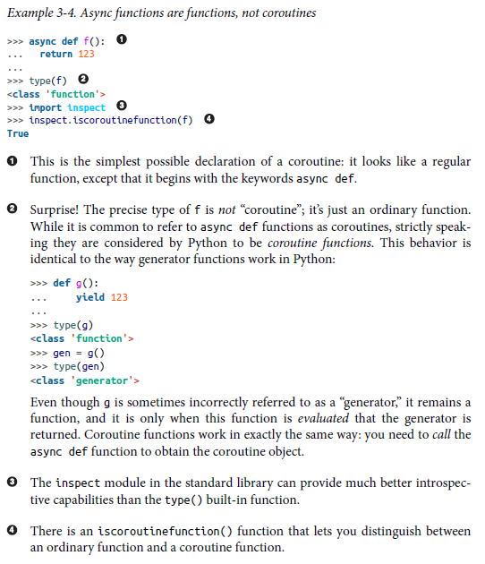
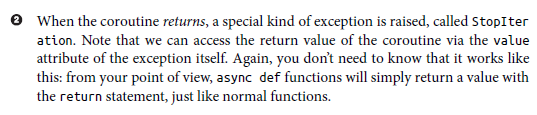

# Using Asyncio in Python by Caleb Hattingh

## 1. Introducing Asyncio
## 2. The Truth About Threads
## 3. Asyncio Walk-Through
## 4. 20 Asyncio Libraries You Aren't Using
## 5. Concluding Thoughts

---
---

# 1. Introducing Asyncio

## What Problem Is Asyncio Trying to Solve ?

For I/O-bound workloads, there are exactly (only!) two reasons to use async-based concurrency over thread-based concurrency:

* Asyncio offers a safer alternative to preemptive multitasking (i.e., using threads), thereby avoiding the bugs, race conditions, and other nondeterministic dangers that frequently occur in nontrivial threaded applications.

* Asyncio offers a simple way to support many thousands of simultaneous socket connections, including being able to handle many long-lived connections for newer technologies like WebSockets, or MQTT for Internet of Things (IoT) applications.

That’s it.

Threading—as a programming model—is best suited to certain kinds of computational tasks that are best executed with multiple CPUs and shared memory for efficient communication between the threads. In such tasks, the use of multicore processing with shared memory is a necessary evil because the problem domain requires it.

Network programming is not one of those domains. The key insight is that network programming involves a great deal of “waiting for things to happen,” and because of this, we don’t need the operating system to efficiently distribute our tasks over multiple CPUs. Furthermore, we don’t need the risks that preemptive multitasking brings, such as race conditions when working with shared memory.

However, there is a great deal of misinformation about other supposed benefits of event-based programming models. Here are a few of the things that just ain’t so:

* *Asyncio will make my code blazing fast.*
  * Unfortunately, no. In fact, most benchmarks seem to show that threading solutions are slightly faster than their comparable Asyncio solutions. If the extent of concurrency itself is considered a performance metric, Asyncio does make it a bit easier to create very large numbers of concurrent socket connections, though. Operating systems often have limits on how many threads can be created, and this number is significantly lower than the number of socket connections that can be made. The OS limits can be changed, but it is certainly easier to do with Asyncio. And while we expect that having many thousands of threads should incur extra context-switching costs that coroutines avoid, it turns out to be difficult to benchmark this in practice.1 No, speed is not the benefit of Asyncio in Python; if that’s what you’re after, try Cython instead!
* *Asyncio makes threading redundant.*
  * Definitely not! The true value of threading lies in being able to write multi-CPU programs, in which different computational tasks can share memory. The numerical library numpy, for instance, already makes use of this by speeding up certain matrix calculations through the use of multiple CPUs, even though all the memory is shared. For sheer performance, there is no competitor to this programming model for CPU-bound computation.
* *Asyncio removes the problems with the GIL.*
  * Again, no. It is true that Asyncio is not affected by the GIL,2 but this is only because the GIL affects multithreaded programs. The “problems” with the GIL that people refer to occur because it prevents true multicore parallelism when using threads. Since Asyncio is single-threaded (almost by definition), it is unaffected by the GIL, but it cannot benefit from multiple CPU cores either.3 It is also worth pointing out that in multithreaded code, the Python GIL can cause additional performance problems beyond what has already been mentioned in other points: Dave Beazley presented a talk on this called “Understanding the Python GIL” at PyCon 2010, and much of what is discussed in that talk remains true today.
* *Asyncio prevents all race conditions.*
  * False. The possibility of race conditions is always present with any concurrent programming, regardless of whether threading or event-based programming is used. It is true that Asyncio can virtually eliminate a certain class of race conditions common in multithreaded programs, such as intra-process shared memory access. However, it doesn’t eliminate the possibility of other kinds of race conditions, such as the interprocess races with shared resources common in distributed microservices architectures. You must still pay attention to how shared resources are being used. The main advantage of Asyncio over threaded code is that the points at which control of execution is transferred between coroutines are visible (because of the presence of await keywords), and thus it is much easier to reason about how shared resources are being accessed.
* *Asyncio makes concurrent programming easy.*
  * Ahem, where do I even begin?

The last myth is the most dangerous one. Dealing with concurrency is always complex, regardless of whether you’re using threading or Asyncio. When experts say “Asyncio makes concurrency easier,” what they really mean is that Asyncio makes it a little easier to avoid certain kinds of truly nightmarish race condition bugs—the kind that keep you up at night and that you tell other programmers about in hushed tones over campfires, wolves howling in the distance.

Even with Asyncio, there is still a great deal of complexity to deal with. How will your application support health checks? How will you communicate with a database that may allow only a few connections—much fewer than your five thousand socket connections to clients? How will your program terminate connections gracefully when you receive a signal to shut down? How will you handle (blocking!) disk access and logging? These are just a few of the many complex design decisions that you will have to answer.

Application design will still be difficult, but the hope is that you will have an easier time reasoning about your application logic when you have only one thread to deal with

# 2. The Truth About Threads

## Introduction

If you’ve never heard of threads before, here’s a basic description: threads are a feature provided by an operating system (OS), made available to software developers so that they may indicate to the OS which parts of their program may be run in parallel. The OS decides how to share CPU resources with each of the parts, much as the OS decides to share CPU resources with all the other different programs (processes) running at the same time.

Since you’re reading an Asyncio book, this must be the part where I tell you, “Threads are terrible, and you should never use them,” right? Unfortunately, the situation is not so simple. We need to weigh the benefits and risks of using threads, just like with any technology choice.

This book is not supposed to be about threads at all. But there are two problems here: Asyncio is offered as an alternative to threading, so it’s hard to understand the value proposition without some comparison; and even when using Asyncio, you will still likely have to deal with threads and processes, so you need to know something about threading.

## Benefits of Threading

These are the main benefits of threading:

* *Ease of reading code*
  * Your code can run concurrently, but still be set out in a very simple, top-down linear sequence of commands to the point where—and this is key—you can pretend, within the body of your functions, that no concurrency is happening.
* *Parallelism with shared memory*
   * Your code can exploit multiple CPUs while still having threads share memory. This is important in many workloads where it would be too costly to move large amounts of data between the separate memory spaces of different processes, for example.
* *Know-how and existing code*
   * There is a large body of knowledge and best practices available for writing threaded applications. There is also a huge amount of existing “blocking” code that depends on multithreading for concurrent operation.

Now, with Python, the point about parallelism is questionable because the Python interpreter uses a global lock, called the global interpreter lock (GIL), to protect the internal state of the interpreter itself. That is, it provides protection from the potential catastrophic effects of race conditions between multiple threads. A side effect of the lock is that it ends up pinning all threads in your program to a single CPU. As you might imagine, this negates any parallelism performance benefits (unless you use tools like Cython or Numba to maneuver around the limitation).

The first point regarding perceived simplicity, however, is significant: threading in Python feels exceptionally simple, and if you haven’t been burned before by impossibly hard race condition bugs, threading offers a very attractive concurrency model. Even if you have been burned in the past, threading remains a compelling option because you will likely have learned (the hard way) how to keep your code both simple and safe.

I don’t have space to get into safer threaded programming here, but generally speaking, the best practice for using threads is to use the ThreadPoolExecutor class from the concurrent.futures module, passing all required data in through the submit() method. Example 2-1 shows a basic example.

```Python3
from concurrent.futures import ThreadPoolExecutor as Executor


def worker(data):
  # <process the data>
  pass


with Executor(max_workers=10) as exe:
  future = exe.submit(worker, data)
```

The ThreadPoolExecutor offers an extremely simple interface for running functions in a thread—and the best part is that, if needed, you can convert the pool of threads into a pool of subprocesses simply by using ProcessPoolExecutor instead. It has the same API as ThreadPoolExecutor, which means that your code will be little affected by the change. The executor API is also used in asyncio and is described in the next chapter (see Example 3-3).

In general, you’ll prefer your tasks to be somewhat short-lived, so that when your program needs to shut down, you can simply call Executor.shutdown(wait=True) and wait a second or two to allow the executor to complete.

Most importantly: if at all possible, you should try to prevent your threaded code (in the preceding example, the worker() function) from accessing or writing to any global variables!

## Drawbacks of Threading

> [N]ontrivial multithreaded programs are incomprehensible to humans. It is true that the programming model can be improved through the use of design patterns, better granularity of atomicity (e.g., transactions), improved languages, and formal methods. However, these techniques merely chip away at the unnecessarily enormous nondeterminism of the threading model. The model remains intrinsically intractable. —Edward A. Lee “The Problem with Threads”

The drawbacks of threading have been mentioned in a few other places already, but for completeness let’s collect them here anyway:

* *Threading is difficult*
  * Threading bugs and race conditions in threaded programs are the hardest kinds of bugs to fix. With experience, it is possible to design new software that is less prone to these problems, but in nontrivial, naively designed software, they can be nearly impossible to fix, even by experts. Really!
* *Threads are resource-intensive*
   * Threads require extra operating system resources to create, such as preallocated, per-thread stack space that consumes process virtual memory up front. This is a big problem with 32-bit operating systems, because the address space per processis limited to 3 GB.1 Nowadays, with the widespread availability of 64-bit operating systems, virtual memory isn’t as precious as it used to be (addressable space for virtual memory is typically 48 bits; i.e., 256 TiB). On modern desktop operating systems, the physical memory required for stack space for each thread isn’t even allocated by the OS until it is required, including stack space per thread. For example, on a modern, 64-bit Fedora 29 Linux with 8 GB memory, creating 10,000 do-nothing threads with this short snippet:

```Python3
import os
from time import sleep
from threading import Thread

threads = [
  Thread(target=lambda: sleep(60)) for i in range(10000)
]

[t.start() for t in threads]
print(f'PID = {os.getpid()}')
[t.join() for t in threads]
```

leads to the following information in top:

```
MiB Mem : 7858.199 total, 1063.844 free, 4900.477 used
MiB Swap: 7935.996 total, 4780.934 free, 3155.062 used

PID USER PR NI VIRT RES SHR COMMAND
15166 caleb 20 0 80.291g 131.1m 4.8m python3
```

Preallocated virtual memory is a staggering ~80 GB (due to 8 MB stack space per thread!), but resident memory is only ~130 MB. On a 32-bit Linux system, I would be unable to create this many because of the 3 GB user-space addressspace limit, regardless of actual consumption of physical memory. To get around this problem on 32-bit systems, it is sometimes necessary to decrease the preconfigured stack size, which you can still do in Python today, with threading.stack_size([size]). Obviously, decreasing stack size has implications for runtime safety with respect to the degree to which function calls may be nested, including recursion. Single-threaded coroutines have none of these problems and are a far superior alternative for concurrent I/O.

* *Threading can affect throughput*
   * At very high concurrency levels (say, >5,000 threads), there can also be an impact on throughput due to context-switching costs, assuming you can figure out how to configure your operating system to even allow you to create that many threads! It has become so tedious on recent macOS versions, for example, to test the preceding 10,000 do-nothing-threads example, that I gave up trying to raise the limits at all.
* *Threading is inflexible*
   * The operating system will continually share CPU time with all threads regardless of whether a thread is ready to do work or not. For instance, a thread may be waiting for data on a socket, but the OS scheduler may still switch to and from that thread thousands of times before any actual work needs to be done. (In the async world, the select() system call is used to check whether a socket-awaiting coroutine needs a turn; if not, that coroutine isn’t even woken up, avoiding any switching costs completely.)

None of this information is new, and the problems with threading as a programming model are not platform-specific either. For example, this is what the Microsoft Visual C++ documentation says about threading:

> The central concurrency mechanism in the Windows API is the thread. You typically use the CreateThread function to create threads. Although threads are relatively easy to create and use, the operating system allocates a significant amount of time and other resources to manage them. Additionally, although each thread is guaranteed to receive the same execution time as any other thread at the same priority level, the associated overhead requires that you create sufficiently large tasks. For smaller or more finegrained tasks, the overhead that is associated with concurrency can outweigh the benefit of running the tasks in parallel.

But—I hear you protest—this is Windows, right? Surely a Unix system doesn’t have these problems? Here follows a similar recommendation from the Mac Developer Library’s Threading Programming Guide:

> Threading has a real cost to your program (and the system) in terms of memory use and performance. Each thread requires the allocation of memory in both the kernel memory space and your program’s memory space. The core structures needed to manage your thread and coordinate its scheduling are stored in the kernel using wired memory. Your thread’s stack space and per-thread data is stored in your program’s memory space. Most of these structures are created and initialized when you first create the thread—a process that can be relatively expensive because of the required interactions with the kernel.

They go even further in the Concurrency Programming Guide (emphasis mine):

> In the past, introducing concurrency to an application required the creation of one or more additional threads. Unfortunately, writing threaded code is challenging. Threads are a low-level tool that must be managed manually. Given that the optimal number of threads for an application can change dynamically based on the current system load and the underlying hardware, implementing a correct threading solution becomes extremely difficult, if not impossible to achieve. In addition, the synchronization mechanisms typically used with threads add complexity and risk to software designs without any guarantees of improved performance.

These themes repeat throughout:

* Threading makes code hard to reason about.
* Threading is an inefficient model for large-scale concurrency (thousands of concurrent tasks)
 
# 3. Asyncio Walk-Through

## The Tower of Asyncio

As you saw in the preceding section, there are only a handful of commands that you need to know to be able to use asyncio as an end-user developer. Unfortunately, the documentation for asyncio presents a huge number of APIs, and it does so in a very “flat” format that makes it hard to tell which things are intended for common use and which are facilities being provided to framework designers.

When framework designers look at the same documentation, they look for hook points to which they can connect up their new frameworks or third-party libraries. In this section, we’ll look at asyncio through the eyes of a framework designer to get a sense of how they might approach building a new async-compatible library. Hopefully, this will help to further delineate the features that you need to care about in your own work.

From this perspective, it is much more useful to think about the asyncio module as being arranged in a hierarchy (rather than a flat list), in which each level is built on top of the specification of the previous level. It isn’t quite as neat as that, unfortunately, and I’ve taken liberties with the arrangement in Table 3-1, but hopefully this will give you an alternative view of the asyncio API.


At the most fundamental level, Tier 1, we have the coroutines that you’ve already seen earlier in this book. This is the lowest level at which one can begin to think about designing a third-party framework, and surprisingly, this turns out to be somewhat popular with not one, but two, async frameworks currently available in the wild: Curio and Trio. Both of these rely only on native coroutines in Python, and nothing whatsoever from the asyncio library module . The next level is the event loop. Coroutines are not useful by themselves: they won’t do anything without a loop on which to run them (therefore, necessarily, Curio and Trio implement their own event loops). asyncio provides both a loop specification, AbstractEventLoop, and an implementation, BaseEventLoop.

The clear separation between specification and implementation makes it possible for third-party developers to make alternative implementations of the event loop, and this has already happened with the uvloop project, which provides a much faster loop implementation than the one in the asyncio standard library module. Importantly, uvloop simply “plugs into” the hierarchy and replaces only the loop part of the stack. The ability to make these kinds of choices is exactly why the asyncio API has been designed like this, with clear separation between the moving parts.

Tiers 3 and 4 bring us futures and tasks, which are very closely related; they’re separated only because Task is a subclass of Future, but they could easily be considered to be in the same tier. A Future instance represents some sort of ongoing action that will return a result via notification on the event loop, while a Task represents a coroutine running on the event loop. The short version is: a future is “loop-aware,” while a task is both “loop-aware” and “coroutine-aware.” As an end-user developer, you will be working with tasks much more than futures, but for a framework designer, the proportion might be the other way around, depending on the details.

Tier 5 represents the facilities for launching, and awaiting on work that must be run in a separate thread, or even in a separate process.

Tier 6 represents additional async-aware tools such as asyncio.Queue. I could have placed this tier after the network tiers, but I think it’s neater to get all of the coroutine-aware APIs out of the way first, before we look at the I/O layers. The Queue provided by asyncio has a very similar API to the thread-safe Queue in the queue module, except that the asyncio version requires the await keyword on get() and put(). You cannot use queue.Queue directly inside coroutines because its get() will block the main thread.

Finally, we have the network I/O tiers, 7 through 9. As an end-user developer, the most convenient API to work with is the streams API at Tier 9. I have positioned the streams API at the highest level of abstraction in the tower. The protocols API, immediately below that (Tier 8), is a more fine-grained API; you can use the protocols tier in all instances where you might use the streams tier, but using streams will be simpler. The final network I/O tier is the transport tier (Tier 7). It is unlikely you will ever have to work with this tier directly, unless you’re creating a framework for others to use and you need to customize how the transports are set up.

In “Quickstart” on page 22, we looked at the absolute bare minimum that one would need to know to get started with the asyncio library. Now that we’ve had a look at how the entire asyncio library API is put together, I’d like to revisit that short list of features and reemphasize which parts you are likely to need to learn.

These are the tiers that are most important to focus on when learning how to use the asyncio library module for writing network applications:

* *Tier 1*
  * Understanding how to write async def functions and use await to call and execute other coroutines is essential.
* *Tier 2*
  * Understanding how to start up, shut down, and interact with the event loop is essential.
* *Tier 5*
  * Executors are necessary to use blocking code in your async application, and the reality is that most third-party libraries are not yet asyncio-compatible. A good example of this is the SQLAlchemy database ORM library, for which no featurecomparable alternative is available right now for asyncio.
* *Tier 6*
  * If you need to feed data to one or more long-running coroutines, the best way to do that is with asyncio.Queue. This is exactly the same strategy as using queue.Queue for distributing data between threads. The Asyncio version of Queue uses the same API as the standard library queue module, but uses coroutines instead of the blocking methods like get().
* *Tier 9*
  * The streams API gives you the simplest way to handle socket communication over a network, and it is here that you should begin prototyping ideas for network applications. You may find that more fine-grained control is needed, and then you could switch to the protocols API, but in most projects it’s usually best to keep things simple until you know exactly what problem you’re trying to solve.

Of course, if you’re using an asyncio-compatible third-party library that handles all the socket communication for you, like aiohttp, you won’t need to directly work with the asyncio network tiers at all. In this case, you must rely heavily on the documentation provided with the library.

The asyncio library tries to provide sufficient features for both end-user developers and framework designers. Unfortunately, this means that the asyncio API can appear somewhat sprawling. I hope that this section has provided enough of a road map to help you pick out the parts you need.

In the next sections, we’re going to look at the component parts of the preceding list in more detail.

## Coroutines

Let’s begin at the very beginning: what is a coroutine?

My goal in this section is to help you understand the specific meaning behind terms like coroutine object and asynchronous function. The examples that follow will show low-level interactions not normally required in most programs; however, the examples will help give you a clearer understanding of the fundamental parts of Asyncio, and will make later sections much easier to grasp.

The following examples can all be reproduced in a Python 3.8 interpreter in interactive mode, and I urge you to work through them on your own by typing them yourself, observing the output, and perhaps experimenting with different ways of interacting with async and await.

## The New ```async def``` Keywords

 

This brings us back to our original question: what exactly is a coroutine? A coroutine is an object that encapsulates the ability to resume an underlying function that has been suspended before completion. If that sounds familiar, it’s because coroutines are very similar to generators. Indeed, before the introduction of native coroutines with the async def and await keywords in Python 3.5, it was already possible to use the asyncio library in Python 3.4 by using normal generators with special decorators.5 It isn’t surprising that the new async def functions (and the coroutines they return) behave in a similar way to generators.

We can play with coroutine objects a bit more to see how Python makes use of them. Most importantly, we want to see how Python is able to “switch” execution between coroutines. Let’s first look at how the return value can be obtained.

When a coroutine returns, what really happens is that a StopIteration exception is raised. Example 3-6, which continues in the same session as the previous examples, makes that clear.

 

These two points, the send() and the StopIteration, define the start and end of the executing coroutine, respectively. So far this just seems like a really convoluted way to run a function, but that’s OK: the event loop will be responsible for driving coroutines with these low-level internals. From your point of view, you will simply schedule coroutines for execution on the loop, and they will get executed top-down, almost like normal functions.

The next step is to see how the execution of the coroutine can be suspended.

## The New ```await``` Keyword

This new keyword await always takes a parameter and will accept only a thing called an awaitable, which is defined as one of these (exclusively!):

* A coroutine (i.e., the result of a called async def function).6

* Any object implementing the ```__await__()``` special method. That special method must return an iterator.

```Python3
import asyncio


async def f():
    await asyncio.sleep(1.0)
    return 123


async def main():
    result = await f()  # Calling f() produces a coroutine; this means we are allowed to await it. The value of the
    # result variable will be 123 when f() completes
    return result
```


The throw() method is used (internally in asyncio) for task cancellation, which we can also demonstrate quite easily. We’re even going to go ahead in Example 3-9 and handle the cancellation inside a new coroutine.

 

## Event Loop

The preceding section showed how the send() and throw() methods can interact with a coroutine, but that was just to help you understand how coroutines themselves are structured. The event loop in asyncio handles all of the switching between coroutines, as well as catching those StopIteration exceptions—and much more, such as listening to sockets and file descriptors for events.

You can get by without ever needing to work with the event loop directly: your asyn cio code can be written entirely using await calls, initiated by an asyncio.run(coro) call. However, at times some degree of interaction with the event loop itself might be necessary, and here we’ll discuss how to obtain it.

There are two ways:

* *Recommended*
  * ```asyncio.get_running_loop()```, callable from inside the context of a coroutine
* *Discouraged*
  * ```asyncio.get_event_loop()```, callable from anywhere

You’re going to see the discouraged function in much existing code, because the newer function, get_running_loop(), was introduced much later, in Python 3.8. Thus, it will be useful in practice having a basic idea of how the older method works, so we’ll look at both. Let’s start with Example 3-12.


This means that if you’re inside a coroutine function and you need access to the loop instance, it’s fine to call get_event_loop() or get_running_loop() to obtain it. You do not need to pass an explicit loop parameter through all your functions.

The situation is different if you’re a framework designer: it would be better to design your functions to accept a loop parameter, just in case your users are doing something unusual with event loop policies. Policies are out of scope for this book, and we’ll say no more about them.

So if get_event_loop() and get_running_loop() work the same, why do they both exist? The get_event_loop() method works only within the same thread. In fact, get_event_loop() will fail if called inside a new thread unless you specifically create a new loop with new_event_loop(), and set that new instance to be the loop for that thread by calling set_event_loop(). Most of us will only ever need (and want!) a single loop instance running in a single thread. This is nearly the entire point of async programming in the first place.

In contrast, get_running_loop() (the recommended method) will always do what you expect: because it can be called only within the context of a coroutine, a task, or a function called from one of those, it always provides the current running event loop, which is almost always what you want.

The introduction of get_running_loop() has also simplified the spawning of background tasks. Consider Example 3-13, a coroutine function inside which additional tasks are created and not awaited.

```Python3
import asyncio


async def f():
    # Create some tasks!
    loop = asyncio.get_event_loop()
    for i in range():
        loop.create_task(<some other coroutine>)
```

In this example, the intention is to launch completely new tasks inside the coroutine. By not awaiting them, we ensure they will run independently of the execution context inside coroutine function f(). In fact, f() will exit before the tasks that it launched have completed.

Before Python 3.7, it was necessary to first obtain the loop instance to schedule a task, but with the introduction of get_running_loop() came other asyncio functions that use it, like asyncio.create_task(). From Python 3.7 on, the code to spawn an async task now looks like Example 3-14.

```Python3
import asyncio


async def f():
    # Create some tasks!
    for i in range():
        asyncio.create_task(<some other coro>)
```

It is also possible to use another low-level function called asyncio.ensure_future() to spawn tasks in the same way as create_task(), and you will likely still see calls to ensure_future() in older asyncio code. I considered avoiding the distraction of discussing ensure_future(), but it is a perfect case study of an asyncio API that was intended only for framework designers, but made the original adoption of asyncio much more difficult to understand for application developers. The difference between asyncio.create_task() and asyncio.ensure_future() is subtle and confusing for many newcomers. We explore these differences in the next section.

# 4. 20 Asyncio Libraries You Aren't Using

\-
